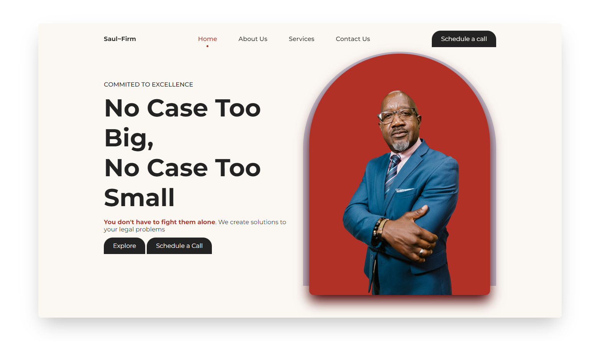

  
  
  
  
  
  
  <h2 align="center">Saul-Firm - A Law Firm Website Concept</h2>

  A fully responsive law firm website concept showcasing my frond-end skills.

  <a href="https://saul-firm.netlify.app/"><strong>➥ Live Demo</strong></a>

### Preview

### Overview
- Developed using Mobile First Approach.
- It's compatible with all devices.
- SEO optimized
- Contains reveal-on-scroll animations.

### Tools Used
- Icons: https://boxicons.com/
- Pictures: https://www.pexels.com/

### Built With
- HTML5
- CSS3
- Javascript

### Source Code
- These are just the starter files, complete source code is on my private repo
